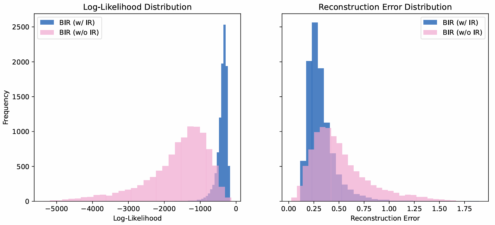

# Teaching AI to Remember: Insights from Brain-Inspired Replay for Continual Learning

Official implementation of **_Teaching AI to Remember: Insights from Brain-Inspired Replay for Continual Learning_ [[pdf]](https://drive.google.com/file/d/1HcYfSXhaHh8bmBdXqJt7Jze87Srz868s/view?usp=sharing) [[slide]](https://drive.google.com/file/d/1HjMsyh-m6IaZrDFm8RsmBsWk8zU29QGa/view?usp=sharing)**.

## Overview

Artificial neural networks (ANNs) excel at learning from large datasets but still suffer from **catastrophic forgetting**—the loss of previously learned knowledge when adapting to new tasks. Inspired by the **memory replay mechanisms** in the human brain, this project investigates the effectiveness of **internal replay** for **long-term memory in AI**.  

Using **CIFAR-100** in a **class-incremental learning (class-IL)** setting, we provide an in-depth analysis of internal replay, both as a standalone mechanism and in combination with **Synaptic Intelligence (SI)**. The findings highlight the **trade-off between memory stability and learning plasticity**, while also revealing limitations of current brain-inspired approaches.  

---

## Motivation

Humans preserve long-term memories through **neural replay**, where patterns of past experiences are reactivated during learning and consolidation. Inspired by this, recent works (e.g., Van de Ven et al. 2020) proposed **brain-inspired replay mechanisms** to improve AI’s continual learning ability.  

In particular, **Van de Ven et al. (2020)** introduced a *Brain-Inspired Replay (BIR)* framework, which extends generative replay by incorporating several biologically motivated components:
- **Replay through feedback**: integrates hippocampal-like generators with cortical-like main models.  
- **Conditional replay**: allows selective reactivation of specific classes through latent mixture modeling.  
- **Context-based gating**: mimics task-dependent neural reactivation.  
- **Internal replay**: replays latent representations rather than raw inputs, closer to how the brain replays experiences.  
- **Distillation**: uses soft targets to stabilize learning when generated samples are imperfect.  

Their analysis highlighted **internal replay** as the *most influential* factor in mitigating catastrophic forgetting, but also showed that the overall model suffered from low absolute performance and poor scalability.  

**This work builds directly on this foundation**:  
- We isolate and study the contribution of **internal replay** in detail.  
- We evaluate its interaction with **Synaptic Intelligence (SI)**, a complementary parameter-constraining method.  
- We provide in-depth analyses (accuracy curves, reconstruction error, UMAP embeddings) to reveal not only its strengths in retention but also its limitations in representational overlap.  

This project therefore extends Van de Ven et al.’s framework by going beyond performance metrics to analyze **how and why internal replay affects learning dynamics**, aiming to inform the design of more effective brain-inspired continual learning systems.  

---

## Methodology

### Models
We evaluate the following variants:
- **BIR (Brain-Inspired Replay)** with and without Internal Replay  
- **BIR + SI (Brain-Inspired Replay + Synaptic Intelligence)** with and without Internal Replay  

### Dataset
- **CIFAR-100** in **Class-Incremental Learning (Class-IL)** setup  
- Sequentially trained on **10 tasks** (10 classes each)  

### Metrics
- **Accuracy**: Initial, final, retention ratio, forgetting score  
- **Log-Likelihood & Reconstruction Error**: Measures representational fidelity  
- **Silhouette Score & UMAP**: Evaluates latent space separability  

---

## Key Results

1. **Retention vs Forgetting**

   - Internal replay (IR) improves **retention ratio** and reduces **forgetting score**, especially when combined with SI. 

   - However, IR also reduces **initial accuracy**, indicating a stability–plasticity trade-off.  

2. **Representation Quality**

   - IR models fit the data better (higher log-likelihood, lower reconstruction error).

   - But hidden layer embeddings remain **poorly separated**, with **high representational overlap** across tasks.  

4. **Trade-Off Observed**

- **BIR + SI (w/ IR)** achieves the best long-term stability.  
- **BIR (w/o IR)** achieves the best short-term plasticity.  

---

## Analysis & Insights
- **Internal Replay** helps mitigate catastrophic forgetting but lowers task-level learning capacity.  
- **Synaptic Intelligence (SI)** provides stability by protecting critical parameters, but slows adaptation.  
- **Open Problem**: How to retain strong initial performance while preventing forgetting.  

---
## Future Directions
- Investigate **sparsity of context-gating masks**
- Explore **layer-wise replay placement**
- Extend analysis with **hippocampus-inspired mechanisms** (e.g., conditional replay, spatial memory)
- Align AI replay models with **neuroscience theories** of memory consolidation

## References
- Van de Ven et al., Brain-inspired replay for continual learning with artificial neural networks. Nature Communications (2020)
- Zenke et al., Continual Learning through Synaptic Intelligence. ICML (2017)
- Bear et al., Neuroscience: Exploring the Brain. Jones & Bartlett (2020)
- Millichamp & Chen (2021), Ran et al. (2024), and other works on brain-inspired continual learning
